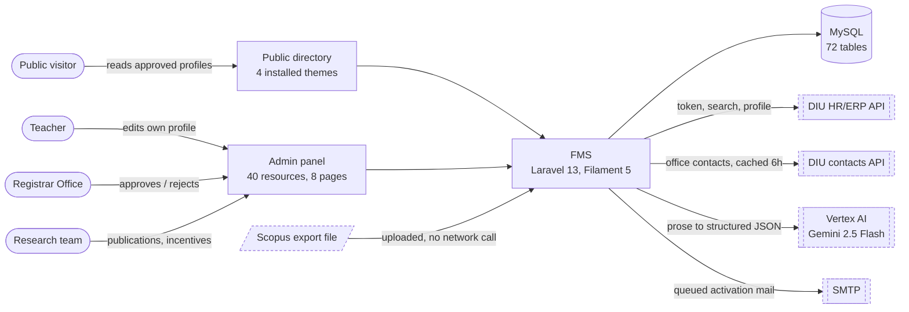
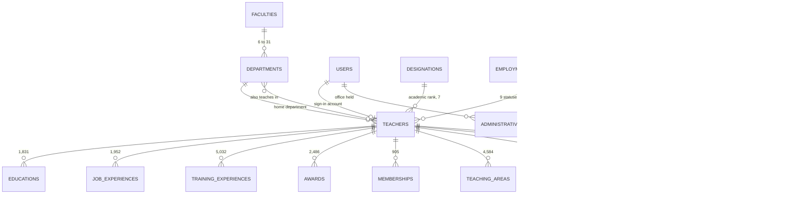
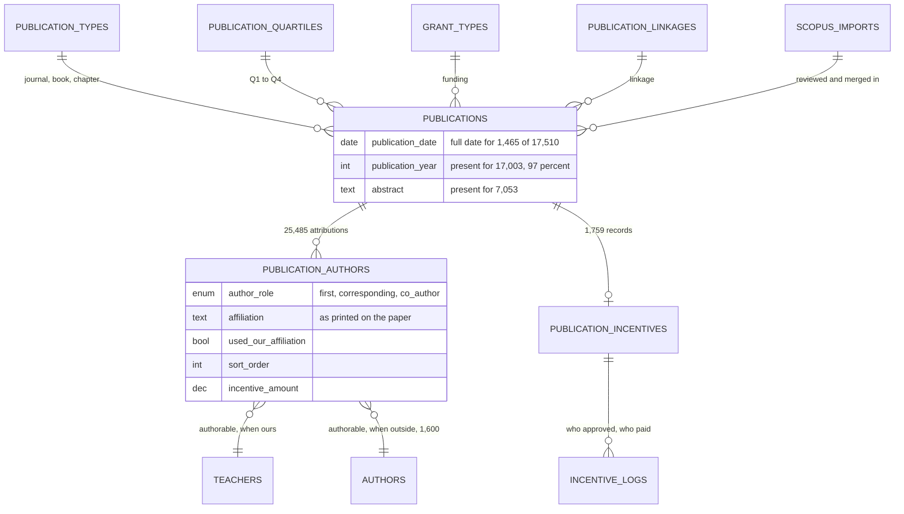
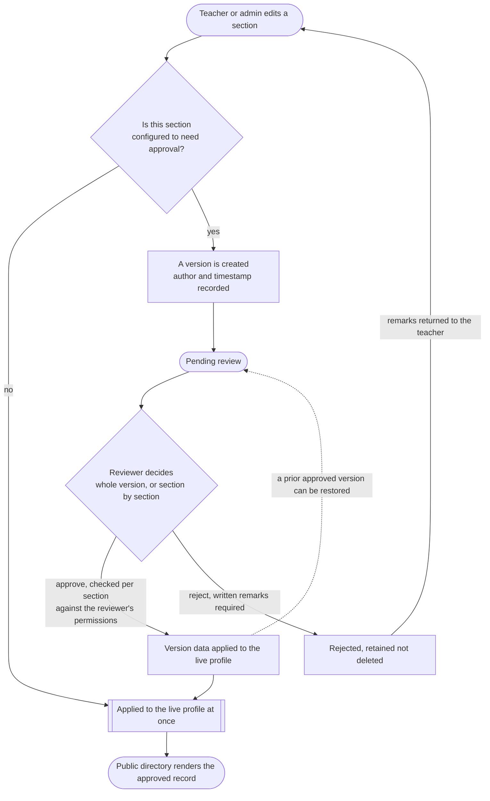
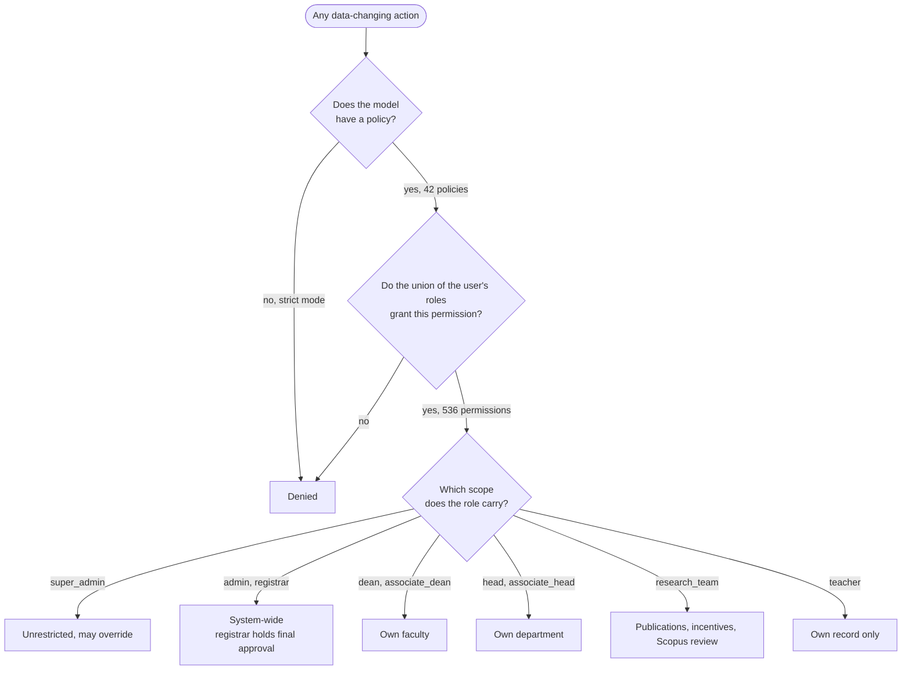
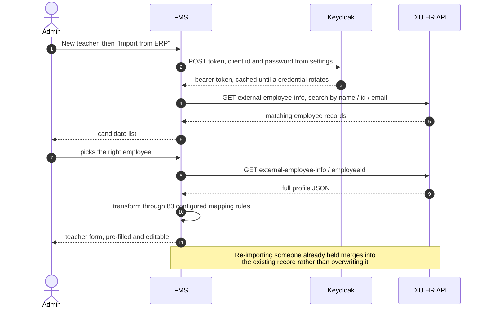
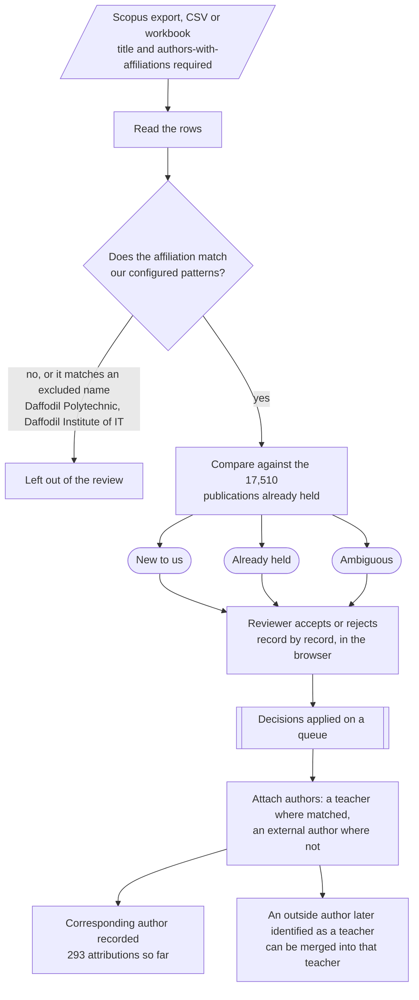
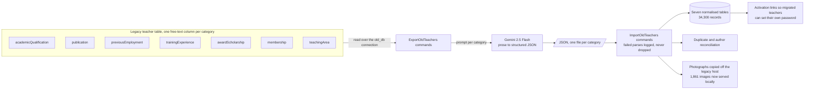

# System Diagrams

## Faculty Management System (FMS) — Daffodil International University

| | |
|---|---|
| **Document** | System Diagrams |
| **System** | Faculty Management System (FMS) |
| **Organisation** | Daffodil International University |
| **Version** | 1.0 |
| **Date** | 2026-08-30 |
| **Notation** | Mermaid — renders on GitHub, GitLab, VS Code and most Markdown viewers |
| **Companion** | *BRD - Faculty Management System.md* · *SRS - Faculty Management System.md* (both revision 2.1) |

---

## About these drawings

Eight drawings of how the system is actually put together — who talks to what,
how the record is shaped, how a change becomes public, and how three separate
pipelines feed data in.

Structure and behaviour were read from the codebase; **every record count was
queried directly against the production database on 2026-08-30**, not estimated.
Where something is marked as awaiting a dependency, that reflects the state of
the settings table on that date.

| Layer | As built |
|---|---|
| Stack | Laravel 13.25 · Filament 5.7 · PHP 8.3 · MySQL · Tailwind 4 / Vite 7 |
| Shape | Server-rendered monolith — a public directory and an admin panel over one database |
| Scale | 72 tables · 53 models · 40 panel resources · 26 widgets · 42 policies · 536 permissions |
| Record | 2,000 teachers (1,128 approved) · 6 faculties · 31 departments · 17,510 publications · 1,759 incentives |
| Outside | DIU HR/ERP API · DIU contacts API · Scopus file export · Google Vertex AI · SMTP |

### Contents

| | Drawing | Notation |
|---|---|---|
| 01 | [System context](#fig-01--system-context) | flowchart |
| 02 | [The teacher record](#fig-02--the-teacher-record) | ER diagram |
| 03 | [Publications and incentives](#fig-03--publications-and-incentives) | ER diagram |
| 04 | [How a change becomes public](#fig-04--how-a-change-becomes-public) | flowchart |
| 05 | [Who is allowed to do what](#fig-05--who-is-allowed-to-do-what) | flowchart |
| 06 | [Creating a teacher from ERP](#fig-06--creating-a-teacher-from-erp) | sequence |
| 07 | [Scopus review and merge](#fig-07--scopus-review-and-merge) | flowchart |
| 08 | [The legacy migration pipeline](#fig-08--the-legacy-migration-pipeline) | flowchart |

---

## Fig. 01 — System context

Four kinds of person reach the system, through two faces of the same
application. Everything drawn with a dashed border is outside our control — and
note that only one of those arrows points inward: the Scopus export is a file
somebody uploads, not a feed the system can pull.

- The public directory and the admin panel are the same Laravel application.
  There is no separate frontend; an early Next.js attempt was removed along with
  its API layer. A token API survives for the department directory mobile apps
  only.
- **Awaiting credentials.** The HR/ERP client is complete and has been run
  against the live directory, but `hr_api_client_id`, `hr_api_username` and
  `hr_api_password` are empty, so the client reports itself unconfigured.

---

## Fig. 02 — The teacher record

This is the shape the whole project exists to create. The legacy system held one
free-text column per category — every degree in one field, every paper in
another. Each of those columns is now a table with its own rows, which is what
makes any counting or filtering possible at all.

- **Seven prose columns became seven tables holding 34,300 records** — roughly 17
  real entries hidden inside each teacher's seven paragraphs. `research_interests`
  was normalised later and is not part of that total.
- Academic rank and administrative office are deliberately separate: gaining or
  losing a deanship does not change a designation.
- Employment status decides public visibility — 878 active, 219 on study leave
  and 31 on leave are shown with the status stated; 872 archived are withheld.

---

## Fig. 03 — Publications and incentives

The research team owns this half. The join table is the interesting part:
authorship is polymorphic, so one row can point at a DIU teacher or at an
outside contributor, and it carries the author's role, the affiliation they
published under, and the share of the incentive they received.

- **Date-range reporting falls back to the year on purpose.** Only 1,465 rows
  carry a full date, so the year — present on 97% — is what every report is
  built on.
- 293 rows are marked as the corresponding author; that attribution comes out of
  the Scopus review in Fig. 07.
- An incentive total must equal the sum of its author amounts — the form refuses
  to save otherwise — and every status change is written to `incentive_logs`.

---

## Fig. 04 — How a change becomes public

The decision that governs everything happens before a version is ever created:
the profile is cut into 15 sections, and each one is separately configured as
needing approval or not. A change to a section that does not need approval is
simply live. Only the others queue.

- **Only one version of a profile is live at a time; rejected versions are kept,
  never removed.** The machinery is complete, but just 2 versions exist in the
  live database — it has not met 2,000 teachers yet.
- All 15 sections are currently configured as requiring approval. Which of them
  genuinely need it is an open decision for the business before rollout.
- **Unexercised.** This is the single largest risk on the project: a queue of
  2,000 teachers arriving at once has never been tested against a real
  reviewing capacity.

---

## Fig. 05 — Who is allowed to do what

Access is not decided by hiding buttons. Every action in the panel passes two
gates before a scope is even considered, and the first gate fails closed: a
model with no policy is denied rather than allowed.

- **Nine roles, and a user may hold several at once** — the effective permission
  is their union. Editing a profile is not a role privilege: whoever also holds a
  teacher record maintains that record, whatever else they are.
- The *IT / Developer* role described in the Milestone-1 governance document was
  never created; maintenance is done under `super_admin`.
- Administrative office is assignable per faculty or per department and
  automatically writes an experience record with start and end dates.
- Escalation to Super Admin on a stalled approval was specified but is not built.

---

## Fig. 06 — Creating a teacher from ERP

Three calls, in a fixed order, all of them at the moment a new teacher is
created. This is the only place in the system that reaches the HR/ERP service —
publications never touch it.

- **The mapping is data, not code.** 83 field rules translate the vendor's field
  names into FMS columns and relations, and are maintained in the panel rather
  than deployed.
- Credentials live in settings, entered by an administrator, so no working
  secret sits in the repository.
- Any URL the server fetches on an operator's behalf is checked against private
  and loopback address ranges first and refused if it resolves inside one.
- **Awaiting credentials.** The base and token URLs are configured; the client
  id, username and password are not, so this flow cannot run in the current
  environment.

---

## Fig. 07 — Scopus review and merge

Publications arrive as a file, not a feed. Nothing in this path makes a network
call — somebody exports from Scopus, uploads the workbook, and the system's job
is to work out which rows are ours and what each one means for the record we
already hold.

- **The institution's own identity is a setting, not a hard-coded string** —
  match patterns, excluded look-alike institutions, email domains and unit
  aliases are all maintained on the Institution Identity page.
- The uploaded file, the matching options used and every decision taken are
  retained, so a review can be reproduced or questioned later. One export has
  been processed to date.
- There is no Scopus API anywhere in the system. The publication record is only
  as current as the last export somebody supplies.

---

## Fig. 08 — The legacy migration pipeline

This ran once, and it was the hardest part of the project. Seven paragraphs per
teacher had to be read, understood and split into individual records — by
machine, with review, rather than by retyping 2,000 profiles.

- **The commands are still in the codebase deliberately** — they are the record
  of how each legacy field was interpreted, and they are not part of the running
  application.
- Legacy access was per department: one shared login, no individual teacher
  accounts. Migrated records therefore begin their audit history at import —
  nothing before that can be attributed to a person.
- What was copied off the legacy host are its 90–120px thumbnails, so image
  quality improves only as teachers upload replacements.
- **Never sent at volume.** Activation email works but has not been sent to
  2,000 people; a staged rollout by faculty is the plan.

---

**Document Status:** Current — drawn against the system as it stands on
2026-08-30  
**Purpose:** Architecture, data and process reference for the BRD and SRS
